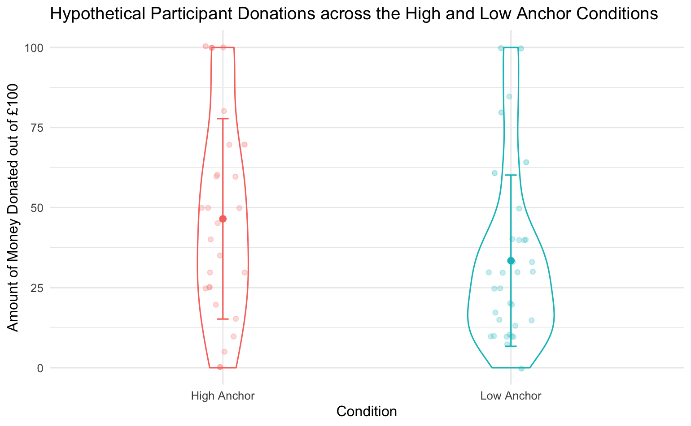

# Violin-Plot-Template
Primarily for used for Lab Reports in my first year of uni.

--- 

# Key Information 

* This project provides a template for a more aesthetically pleasing violin plot with the option of additional errorbars. 
* Tested in R Studio Version `4.0.2` and intended for that program, with the use of ggplot2 in the tidyverse package. 
* There is no dataset provided with the IRL Example code.
   * This is to maintain participant confidentiality. 
* All explanatory information is within the .Rmd file; please refer to notes in that file for more clarification. 
* All IRL Examples but the last one can be seen 'in context' by viewing the data analysis and visualisation code from [Lab Report 5](Lab_5_Analysis_and_Viz.Rmd)

Final Example of Violin Plot (from Lab 5)

# How, Why and When:

 > After being inspired by my peer's more sophisticated looking graphs,
 > I decided to go ahead and play around with R to make my ggplot data
 > visualisations look a little bit more classy. This template is the 
 > what came about after 14 hours of experimentation, frustration and 
 > small breakthroughs! After finalising the data viz, it became a key
 > part of my coursework and one that I would look forward to making, 
 > since it would provide some semblance of stress-relief in the midst
 > of the lab report wiritng process.  

